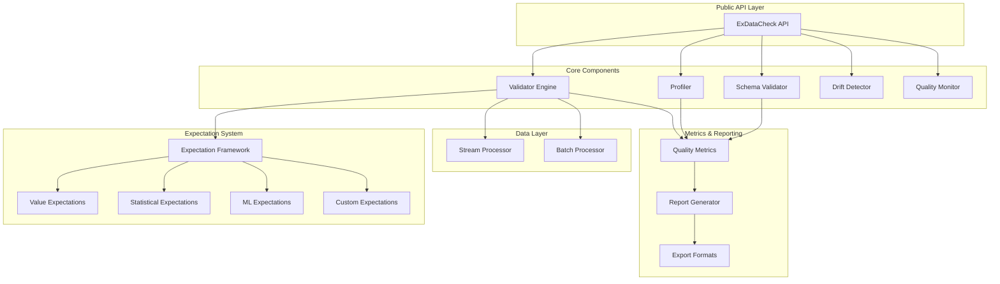
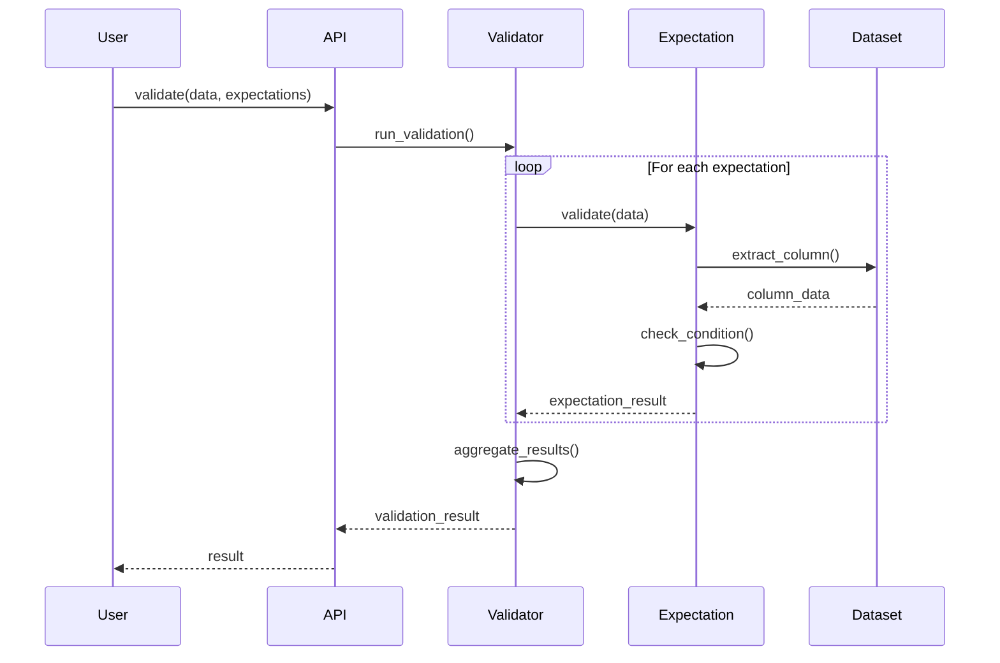
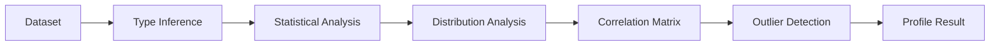
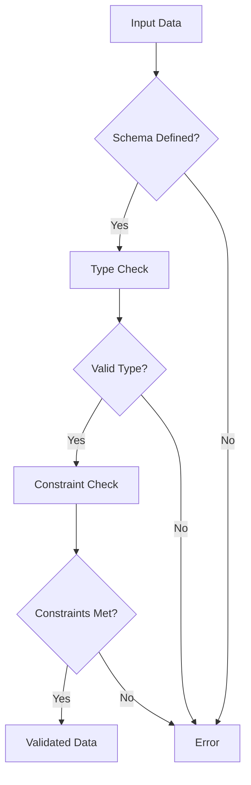
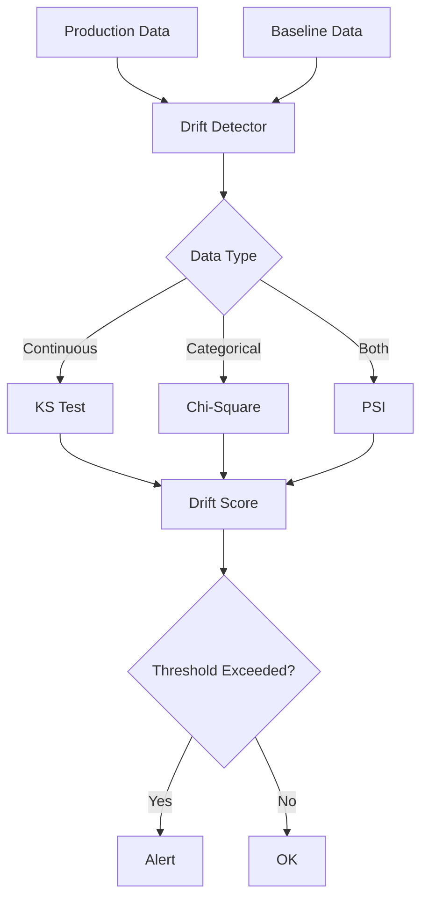
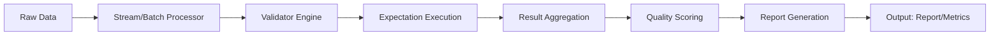
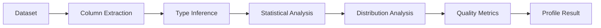

# ExDataCheck Architecture

## Overview

ExDataCheck is built around a modular, extensible architecture designed for high-performance data validation in ML pipelines. The system is organized into distinct layers with clear separation of concerns.

## Architecture Diagram



## Core Components

### 1. Validator Engine

**Responsibilities:**
- Execute expectations against datasets
- Coordinate validation workflow
- Aggregate validation results
- Handle streaming and batch modes

**Key Modules:**
- `ExDataCheck.Validator` - Main validation orchestrator
- `ExDataCheck.ValidationResult` - Result structures
- `ExDataCheck.ValidationContext` - Execution context

**Design Patterns:**
- Pipeline pattern for validation flow
- Strategy pattern for different validation modes
- Builder pattern for result aggregation

### 2. Expectation System

**Responsibilities:**
- Define expectation contracts
- Implement expectation validators
- Support custom expectations
- Type-safe expectation definitions

**Key Modules:**
- `ExDataCheck.Expectation` - Base expectation behavior
- `ExDataCheck.Expectations.Value` - Value-based checks
- `ExDataCheck.Expectations.Statistical` - Statistical checks
- `ExDataCheck.Expectations.ML` - ML-specific checks
- `ExDataCheck.Expectations.Schema` - Schema checks

**Expectation Lifecycle:**


### 3. Profiler

**Responsibilities:**
- Generate statistical profiles of datasets
- Calculate column-level statistics
- Detect data types and cardinality
- Identify outliers and anomalies

**Key Modules:**
- `ExDataCheck.Profile` - Profile structure
- `ExDataCheck.Profiler.ColumnProfiler` - Column-level profiling
- `ExDataCheck.Profiler.Statistics` - Statistical calculations
- `ExDataCheck.Profiler.TypeInference` - Type detection

**Profile Generation Flow:**


### 4. Schema Validator

**Responsibilities:**
- Define and enforce schemas
- Type checking and coercion
- Constraint validation
- Nested structure support

**Key Modules:**
- `ExDataCheck.Schema` - Schema definition
- `ExDataCheck.Schema.Validator` - Schema validation
- `ExDataCheck.Schema.Types` - Type system
- `ExDataCheck.Schema.Constraints` - Constraint checks

**Schema Validation Process:**


### 5. Quality Monitor

**Responsibilities:**
- Track quality metrics over time
- Detect quality degradation
- Alert on threshold violations
- Store quality history

**Key Modules:**
- `ExDataCheck.Monitor` - Monitoring orchestrator
- `ExDataCheck.Monitor.Tracker` - Metric tracking
- `ExDataCheck.Monitor.Alerter` - Alert system
- `ExDataCheck.Monitor.Storage` - Metric storage

### 6. Drift Detector

**Responsibilities:**
- Detect data distribution drift
- Compare distributions
- Calculate drift scores
- Support multiple drift detection methods

**Key Modules:**
- `ExDataCheck.Drift` - Drift detection API
- `ExDataCheck.Drift.KS` - Kolmogorov-Smirnov test
- `ExDataCheck.Drift.ChiSquare` - Chi-square test
- `ExDataCheck.Drift.PSI` - Population Stability Index

**Drift Detection Methods:**


## Data Flow

### Validation Pipeline



### Profiling Pipeline



## Key Design Decisions

### 1. Streaming Support

**Decision:** Support both streaming and batch processing
**Rationale:** ML pipelines often process large datasets that don't fit in memory
**Implementation:** Use Elixir streams for lazy evaluation

```elixir
# Stream processing
dataset
|> Stream.chunk_every(1000)
|> Stream.map(&ExDataCheck.validate(&1, expectations))
|> Stream.each(&handle_result/1)
|> Stream.run()
```

### 2. Expectation Composition

**Decision:** Expectations are composable and chainable
**Rationale:** Complex validations require multiple expectations
**Implementation:** List-based expectation definitions

```elixir
expectations = [
  expect_column_to_exist(:age),
  expect_column_values_to_be_between(:age, 0, 120),
  expect_column_mean_to_be_between(:age, 25, 35)
]
```

### 3. Type System

**Decision:** Support rich type system with nested structures
**Rationale:** ML data often has complex nested structures
**Implementation:** Recursive type validation

```elixir
schema = [
  {:features, {:list, :float}},
  {:metadata, :map},
  {:labels, {:list, :atom}}
]
```

### 4. Plugin Architecture

**Decision:** Support custom expectations via behavior
**Rationale:** Users need domain-specific validations
**Implementation:** Expectation behavior with callbacks

```elixir
defmodule MyCustomExpectation do
  @behaviour ExDataCheck.Expectation

  @impl true
  def validate(data, opts) do
    # Custom validation logic
  end
end
```

## Performance Considerations

### 1. Lazy Evaluation

- Use streams for large datasets
- Defer computation until necessary
- Enable early termination on failures

### 2. Parallel Processing

- Expectations can run in parallel
- Column-level profiling parallelized
- Configurable concurrency

### 3. Sampling

- Support sampling for profiling large datasets
- Configurable sample size
- Stratified sampling for distribution preservation

### 4. Caching

- Cache profiling results
- Reuse baseline distributions
- Memoize expensive calculations

## Extensibility Points

### 1. Custom Expectations

Users can define custom expectations by implementing the `Expectation` behavior:

```elixir
defmodule MyExpectation do
  @behaviour ExDataCheck.Expectation

  @impl true
  def validate(dataset, column, opts) do
    # Validation logic
  end

  @impl true
  def describe(column, opts) do
    "Custom expectation description"
  end
end
```

### 2. Custom Metrics

Define custom quality metrics:

```elixir
defmodule MyQualityMetric do
  @behaviour ExDataCheck.QualityMetric

  @impl true
  def calculate(dataset) do
    # Metric calculation
  end
end
```

### 3. Custom Reporters

Add custom report formats:

```elixir
defmodule MyReporter do
  @behaviour ExDataCheck.Reporter

  @impl true
  def generate(result, opts) do
    # Report generation
  end
end
```

## Error Handling

### Validation Errors

- Collect all errors, don't fail fast (by default)
- Provide detailed error messages
- Include context (row number, column, value)

### System Errors

- Graceful degradation on failures
- Log errors with context
- Return error tuples `{:error, reason}`

## Testing Strategy

### Unit Tests

- Test each expectation independently
- Test edge cases and boundary conditions
- Test error handling

### Integration Tests

- Test validation pipelines end-to-end
- Test with realistic datasets
- Test performance with large datasets

### Property-Based Tests

- Use StreamData for property tests
- Test expectation invariants
- Test schema validation properties

## Future Enhancements

### 1. Distributed Processing

- Support for distributed datasets
- Partition-aware validation
- Distributed profiling

### 2. Incremental Validation

- Validate only changed data
- Maintain validation state
- Efficient re-validation

### 3. Machine Learning Integration

- Auto-generate expectations from data
- Learn normal distributions
- Adaptive thresholds

### 4. Visualization

- Interactive validation reports
- Distribution plots
- Drift visualization
