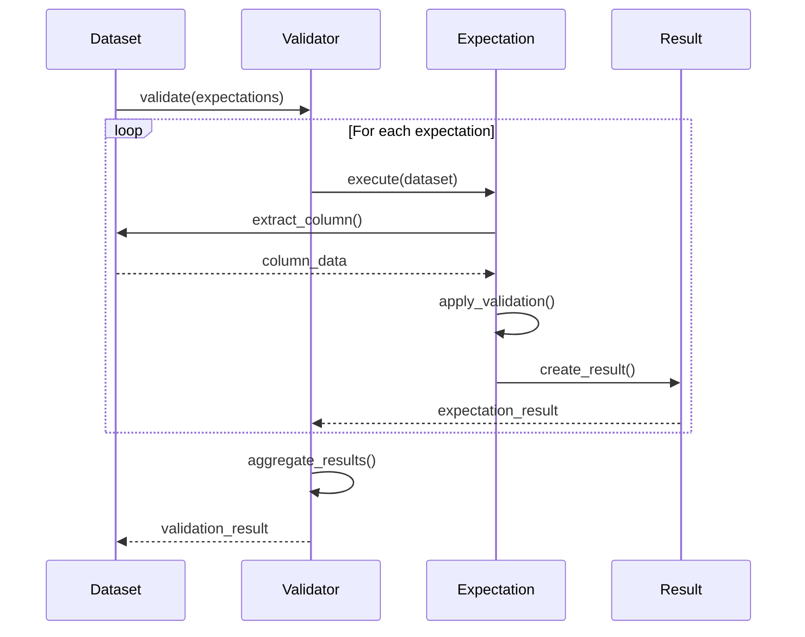

# Expectation System Design

## Overview

The expectation system is the core of ExDataCheck's validation framework. Inspired by Great Expectations, it provides a declarative way to define data quality requirements.

## Expectation Behavior

All expectations implement the `ExDataCheck.Expectation` behavior:

```elixir
defmodule ExDataCheck.Expectation do
  @type dataset :: list(map()) | Stream.t()
  @type column :: atom() | String.t()
  @type result :: %ExDataCheck.ExpectationResult{}
  @type opts :: keyword()

  @callback validate(dataset, column, opts) :: result
  @callback describe(column, opts) :: String.t()
end
```

## Expectation Categories

### 1. Value Expectations

Test individual values in a column.

#### `expect_column_values_to_be_between/3`

```elixir
@spec expect_column_values_to_be_between(column, min, max) :: expectation
```

**Purpose:** Ensure all values in a column fall within a specified range.

**Implementation:**
```elixir
defmodule ExDataCheck.Expectations.Value do
  def expect_column_values_to_be_between(column, min, max) do
    %Expectation{
      type: :value_range,
      column: column,
      validator: fn dataset ->
        values = extract_column(dataset, column)
        failing = Enum.filter(values, fn v -> v < min or v > max end)

        %ExpectationResult{
          success: length(failing) == 0,
          expectation: "column #{column} values between #{min} and #{max}",
          observed: %{
            total_values: length(values),
            failing_values: length(failing),
            failing_examples: Enum.take(failing, 5)
          }
        }
      end
    }
  end
end
```

**Usage:**
```elixir
expect_column_values_to_be_between(:age, 0, 120)
expect_column_values_to_be_between(:score, 0.0, 1.0)
```

#### `expect_column_values_to_be_in_set/2`

```elixir
@spec expect_column_values_to_be_in_set(column, set :: list()) :: expectation
```

**Purpose:** Ensure all values are members of a specified set.

**Implementation:**
```elixir
def expect_column_values_to_be_in_set(column, allowed_values) do
  set = MapSet.new(allowed_values)

  %Expectation{
    type: :value_set,
    column: column,
    validator: fn dataset ->
      values = extract_column(dataset, column)
      invalid = Enum.reject(values, &MapSet.member?(set, &1))

      %ExpectationResult{
        success: length(invalid) == 0,
        expectation: "column #{column} values in set #{inspect(allowed_values)}",
        observed: %{
          total_values: length(values),
          invalid_values: Enum.uniq(invalid),
          invalid_count: length(invalid)
        }
      }
    end
  }
end
```

**Usage:**
```elixir
expect_column_values_to_be_in_set(:status, ["active", "pending", "completed"])
expect_column_values_to_be_in_set(:country, ["US", "UK", "CA"])
```

#### `expect_column_values_to_match_regex/2`

```elixir
@spec expect_column_values_to_match_regex(column, regex :: Regex.t()) :: expectation
```

**Purpose:** Ensure values match a regular expression pattern.

**Usage:**
```elixir
expect_column_values_to_match_regex(:email, ~r/@/)
expect_column_values_to_match_regex(:phone, ~r/^\d{3}-\d{3}-\d{4}$/)
```

#### `expect_column_values_to_not_be_null/1`

```elixir
@spec expect_column_values_to_not_be_null(column) :: expectation
```

**Purpose:** Ensure no null/nil values in column.

**Usage:**
```elixir
expect_column_values_to_not_be_null(:user_id)
expect_column_values_to_not_be_null(:timestamp)
```

#### `expect_column_values_to_be_unique/1`

```elixir
@spec expect_column_values_to_be_unique(column) :: expectation
```

**Purpose:** Ensure all values are unique (no duplicates).

**Usage:**
```elixir
expect_column_values_to_be_unique(:transaction_id)
expect_column_values_to_be_unique(:email)
```

### 2. Statistical Expectations

Test statistical properties of columns.

#### `expect_column_mean_to_be_between/3`

```elixir
@spec expect_column_mean_to_be_between(column, min, max) :: expectation
```

**Purpose:** Ensure column mean falls within range.

**Implementation:**
```elixir
def expect_column_mean_to_be_between(column, min, max) do
  %Expectation{
    type: :statistical_mean,
    column: column,
    validator: fn dataset ->
      values = extract_column(dataset, column) |> Enum.filter(&is_number/1)
      mean = Statistics.mean(values)

      %ExpectationResult{
        success: mean >= min and mean <= max,
        expectation: "column #{column} mean between #{min} and #{max}",
        observed: %{
          mean: mean,
          count: length(values)
        }
      }
    end
  }
end
```

**Usage:**
```elixir
expect_column_mean_to_be_between(:age, 25, 45)
expect_column_mean_to_be_between(:score, 0.7, 0.9)
```

#### `expect_column_stdev_to_be_between/3`

```elixir
@spec expect_column_stdev_to_be_between(column, min, max) :: expectation
```

**Purpose:** Ensure column standard deviation falls within range.

**Usage:**
```elixir
expect_column_stdev_to_be_between(:scores, 0.1, 0.3)
```

#### `expect_column_median_to_be_between/3`

```elixir
@spec expect_column_median_to_be_between(column, min, max) :: expectation
```

**Purpose:** Ensure column median falls within range.

**Usage:**
```elixir
expect_column_median_to_be_between(:income, 40000, 60000)
```

#### `expect_column_quantile_to_be/3`

```elixir
@spec expect_column_quantile_to_be(column, quantile :: float, expected :: number) :: expectation
```

**Purpose:** Check specific quantile values.

**Usage:**
```elixir
expect_column_quantile_to_be(:age, 0.95, 65)  # 95th percentile should be ~65
expect_column_quantile_to_be(:latency, 0.99, 500)  # p99 latency
```

### 3. ML-Specific Expectations

Expectations designed for machine learning workflows.

#### `expect_feature_distribution/3`

```elixir
@spec expect_feature_distribution(column, distribution :: atom, opts :: keyword) :: expectation
```

**Purpose:** Ensure feature follows expected distribution.

**Supported Distributions:**
- `:normal` - Normal/Gaussian distribution
- `:uniform` - Uniform distribution
- `:exponential` - Exponential distribution
- `:binomial` - Binomial distribution

**Implementation:**
```elixir
def expect_feature_distribution(column, :normal, opts) do
  expected_mean = Keyword.fetch!(opts, :mean)
  expected_stdev = Keyword.fetch!(opts, :stdev)
  tolerance = Keyword.get(opts, :tolerance, 0.1)

  %Expectation{
    type: :distribution,
    column: column,
    validator: fn dataset ->
      values = extract_column(dataset, column)
      observed_mean = Statistics.mean(values)
      observed_stdev = Statistics.stdev(values)

      # Kolmogorov-Smirnov test
      ks_statistic = ks_test(values, :normal, expected_mean, expected_stdev)

      %ExpectationResult{
        success: ks_statistic < tolerance,
        expectation: "column #{column} follows normal distribution",
        observed: %{
          mean: observed_mean,
          stdev: observed_stdev,
          ks_statistic: ks_statistic
        }
      }
    end
  }
end
```

**Usage:**
```elixir
expect_feature_distribution(:age, :normal, mean: 35, stdev: 10)
expect_feature_distribution(:score, :uniform, min: 0.0, max: 1.0)
```

#### `expect_label_balance/2`

```elixir
@spec expect_label_balance(column, opts :: keyword) :: expectation
```

**Purpose:** Ensure classification labels are reasonably balanced.

**Implementation:**
```elixir
def expect_label_balance(column, opts) do
  min_ratio = Keyword.get(opts, :min_ratio, 0.2)

  %Expectation{
    type: :label_balance,
    column: column,
    validator: fn dataset ->
      values = extract_column(dataset, column)
      counts = Enum.frequencies(values)
      total = length(values)
      ratios = Map.new(counts, fn {k, v} -> {k, v / total} end)
      min_observed = Enum.min(Map.values(ratios))

      %ExpectationResult{
        success: min_observed >= min_ratio,
        expectation: "column #{column} labels balanced (min ratio: #{min_ratio})",
        observed: %{
          ratios: ratios,
          min_ratio: min_observed,
          counts: counts
        }
      }
    end
  }
end
```

**Usage:**
```elixir
expect_label_balance(:class, min_ratio: 0.3)  # No class < 30%
expect_label_balance(:sentiment, min_ratio: 0.2)
```

#### `expect_feature_correlation/3`

```elixir
@spec expect_feature_correlation(column1, column2, opts :: keyword) :: expectation
```

**Purpose:** Check correlation between features (detect multicollinearity).

**Usage:**
```elixir
expect_feature_correlation(:feature_a, :feature_b, max: 0.9)
expect_feature_correlation(:age, :tenure, min: 0.3, max: 0.7)
```

#### `expect_no_data_drift/2`

```elixir
@spec expect_no_data_drift(column, baseline :: %{}) :: expectation
```

**Purpose:** Detect data drift from training distribution.

**Implementation:**
```elixir
def expect_no_data_drift(column, baseline) do
  %Expectation{
    type: :drift_detection,
    column: column,
    validator: fn dataset ->
      values = extract_column(dataset, column)
      drift_score = calculate_drift(values, baseline)
      threshold = 0.05  # p-value threshold

      %ExpectationResult{
        success: drift_score > threshold,
        expectation: "column #{column} no significant drift from baseline",
        observed: %{
          drift_score: drift_score,
          method: :kolmogorov_smirnov,
          drifted: drift_score <= threshold
        }
      }
    end
  }
end
```

**Usage:**
```elixir
baseline = ExDataCheck.Drift.create_baseline(training_data, :age)
expect_no_data_drift(:age, baseline)
```

### 4. Schema Expectations

Validate data structure and types.

#### `expect_column_to_exist/1`

```elixir
@spec expect_column_to_exist(column) :: expectation
```

**Purpose:** Ensure column exists in dataset.

**Usage:**
```elixir
expect_column_to_exist(:user_id)
expect_column_to_exist(:timestamp)
```

#### `expect_column_to_be_of_type/2`

```elixir
@spec expect_column_to_be_of_type(column, type :: atom) :: expectation
```

**Supported Types:**
- `:integer`
- `:float`
- `:string`
- `:boolean`
- `:atom`
- `:list`
- `:map`
- `:datetime`

**Usage:**
```elixir
expect_column_to_be_of_type(:age, :integer)
expect_column_to_be_of_type(:score, :float)
expect_column_to_be_of_type(:tags, :list)
```

#### `expect_column_count_to_equal/1`

```elixir
@spec expect_column_count_to_equal(count :: integer) :: expectation
```

**Purpose:** Ensure dataset has exact number of columns.

**Usage:**
```elixir
expect_column_count_to_equal(10)
```

#### `expect_table_row_count_to_be_between/2`

```elixir
@spec expect_table_row_count_to_be_between(min, max) :: expectation
```

**Purpose:** Ensure dataset has expected number of rows.

**Usage:**
```elixir
expect_table_row_count_to_be_between(1000, 10000)
expect_table_row_count_to_be_between(100, :infinity)
```

## Expectation Result Structure

```elixir
defmodule ExDataCheck.ExpectationResult do
  @type t :: %__MODULE__{
    success: boolean(),
    expectation: String.t(),
    observed: map(),
    metadata: map()
  }

  defstruct [
    :success,
    :expectation,
    :observed,
    metadata: %{}
  ]
end
```

## Validation Flow



## Custom Expectations

Users can define custom expectations:

```elixir
defmodule MyApp.CustomExpectations do
  use ExDataCheck.Expectation

  def expect_valid_email(column) do
    %Expectation{
      type: :custom_email,
      column: column,
      validator: fn dataset ->
        values = extract_column(dataset, column)
        invalid = Enum.reject(values, &valid_email?/1)

        %ExpectationResult{
          success: length(invalid) == 0,
          expectation: "column #{column} contains valid emails",
          observed: %{
            total: length(values),
            invalid_count: length(invalid),
            invalid_examples: Enum.take(invalid, 5)
          }
        }
      end
    }
  end

  defp valid_email?(email) do
    # Email validation logic
    String.match?(email, ~r/@/)
  end
end
```

## Expectation Suites

Group related expectations:

```elixir
defmodule MyApp.ExpectationSuites do
  def user_data_suite do
    [
      expect_column_to_exist(:user_id),
      expect_column_values_to_be_unique(:user_id),
      expect_column_values_to_not_be_null(:email),
      expect_column_values_to_match_regex(:email, ~r/@/),
      expect_column_values_to_be_between(:age, 18, 100)
    ]
  end

  def ml_training_suite do
    [
      expect_no_missing_values(:features),
      expect_label_balance(:target, min_ratio: 0.2),
      expect_column_count_to_equal(10),
      expect_table_row_count_to_be_between(1000, 1_000_000)
    ]
  end
end
```

## Best Practices

### 1. Start Simple

Begin with basic expectations and add complexity as needed:

```elixir
# Start with
expectations = [
  expect_column_to_exist(:age)
]

# Then add
expectations = [
  expect_column_to_exist(:age),
  expect_column_to_be_of_type(:age, :integer)
]

# Finally refine
expectations = [
  expect_column_to_exist(:age),
  expect_column_to_be_of_type(:age, :integer),
  expect_column_values_to_be_between(:age, 0, 120),
  expect_column_mean_to_be_between(:age, 25, 45)
]
```

### 2. Use Profiling to Inform Expectations

Profile your data first to understand reasonable thresholds:

```elixir
profile = ExDataCheck.profile(data)
# Use profile statistics to set expectation thresholds
expect_column_mean_to_be_between(:age,
  profile.columns.age.mean * 0.9,
  profile.columns.age.mean * 1.1
)
```

### 3. Combine Expectations

Layer expectations for comprehensive validation:

```elixir
[
  # Schema validation
  expect_column_to_exist(:score),
  expect_column_to_be_of_type(:score, :float),

  # Value validation
  expect_column_values_to_be_between(:score, 0.0, 1.0),
  expect_column_values_to_not_be_null(:score),

  # Statistical validation
  expect_column_mean_to_be_between(:score, 0.7, 0.9),
  expect_column_stdev_to_be_between(:score, 0.1, 0.3)
]
```

### 4. Document Your Expectations

Add metadata to expectations:

```elixir
%Expectation{
  type: :value_range,
  column: :age,
  validator: validator_fn,
  metadata: %{
    rationale: "Age should be reasonable for adult users",
    impact: "Critical - invalid ages break downstream models",
    owner: "data-team"
  }
}
```
