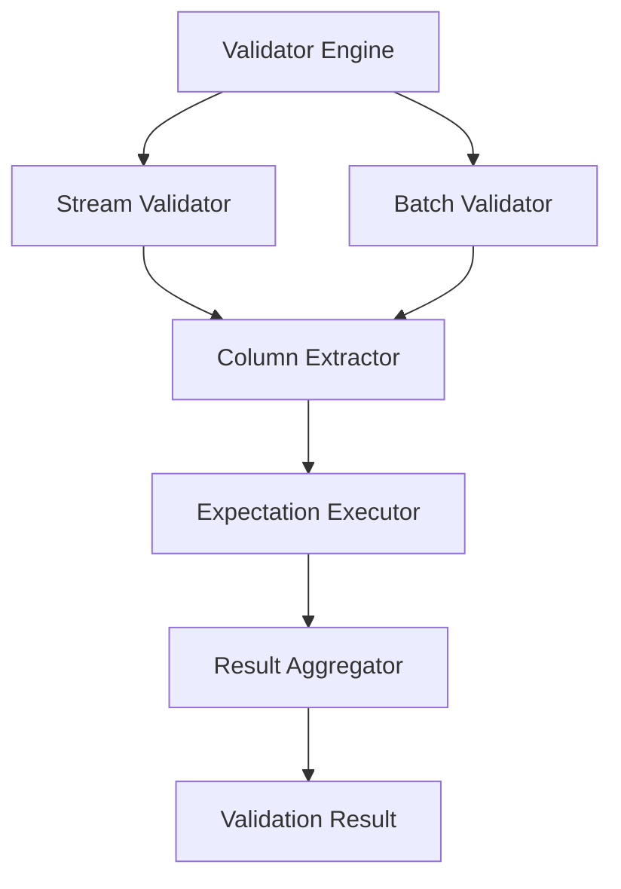

# Validator Specifications

## Overview

This document describes the validator implementations that execute expectations and generate validation results.

## Validator Architecture



## Core Validator Module

### ExDataCheck.Validator

The main validator orchestrator.

```elixir
defmodule ExDataCheck.Validator do
  @moduledoc """
  Core validation engine for executing expectations against datasets.
  """

  @type dataset :: list(map()) | Stream.t()
  @type expectations :: list(Expectation.t())
  @type result :: ValidationResult.t()

  @doc """
  Validates a dataset against a list of expectations.

  ## Options

    * `:mode` - `:batch` (default) or `:stream`
    * `:stop_on_failure` - Stop at first failure (default: false)
    * `:parallel` - Run expectations in parallel (default: true)
    * `:max_failures` - Maximum failures before stopping (default: nil)
    * `:sample_size` - Sample size for large datasets (default: nil)

  ## Examples

      iex> ExDataCheck.Validator.validate(data, expectations)
      %ValidationResult{success: true, ...}

      iex> ExDataCheck.Validator.validate(stream, expectations, mode: :stream)
      %ValidationResult{success: false, ...}
  """
  @spec validate(dataset, expectations, keyword()) :: result
  def validate(dataset, expectations, opts \\ []) do
    mode = Keyword.get(opts, :mode, :batch)

    case mode do
      :batch -> validate_batch(dataset, expectations, opts)
      :stream -> validate_stream(dataset, expectations, opts)
    end
  end

  @doc """
  Validates and raises on failure.
  """
  @spec validate!(dataset, expectations, keyword()) :: :ok | no_return()
  def validate!(dataset, expectations, opts \\ []) do
    case validate(dataset, expectations, opts) do
      %{success: true} = result ->
        :ok

      %{success: false} = result ->
        raise ValidationError, result: result
    end
  end
end
```

## Batch Validator

Validates entire dataset in memory.

```elixir
defmodule ExDataCheck.Validator.Batch do
  @moduledoc """
  Batch validator for in-memory datasets.
  """

  def validate(dataset, expectations, opts) do
    stop_on_failure = Keyword.get(opts, :stop_on_failure, false)
    parallel = Keyword.get(opts, :parallel, true)

    results =
      if parallel do
        validate_parallel(dataset, expectations, opts)
      else
        validate_sequential(dataset, expectations, opts)
      end

    aggregate_results(results, dataset)
  end

  defp validate_parallel(dataset, expectations, opts) do
    expectations
    |> Task.async_stream(
      fn expectation ->
        execute_expectation(dataset, expectation)
      end,
      max_concurrency: System.schedulers_online()
    )
    |> Enum.map(fn {:ok, result} -> result end)
  end

  defp validate_sequential(dataset, expectations, opts) do
    stop_on_failure = Keyword.get(opts, :stop_on_failure, false)

    Enum.reduce_while(expectations, [], fn expectation, acc ->
      result = execute_expectation(dataset, expectation)

      if stop_on_failure and not result.success do
        {:halt, [result | acc]}
      else
        {:cont, [result | acc]}
      end
    end)
    |> Enum.reverse()
  end

  defp execute_expectation(dataset, expectation) do
    try do
      expectation.validator.(dataset)
    rescue
      error ->
        %ExpectationResult{
          success: false,
          expectation: expectation.type,
          observed: %{error: Exception.message(error)},
          metadata: %{exception: error}
        }
    end
  end

  defp aggregate_results(results, dataset) do
    total = length(results)
    successes = Enum.count(results, & &1.success)
    failures = total - successes

    %ValidationResult{
      success: failures == 0,
      total_expectations: total,
      expectations_met: successes,
      expectations_failed: failures,
      results: results,
      dataset_info: %{
        row_count: length(dataset),
        columns: extract_columns(dataset)
      }
    }
  end

  defp extract_columns(dataset) do
    dataset
    |> List.first()
    |> case do
      nil -> []
      row when is_map(row) -> Map.keys(row)
      _ -> []
    end
  end
end
```

## Stream Validator

Validates streaming datasets without loading into memory.

```elixir
defmodule ExDataCheck.Validator.Stream do
  @moduledoc """
  Stream validator for large datasets that don't fit in memory.
  """

  def validate(stream, expectations, opts) do
    chunk_size = Keyword.get(opts, :chunk_size, 1000)

    results =
      stream
      |> Stream.chunk_every(chunk_size)
      |> Stream.map(&validate_chunk(&1, expectations, opts))
      |> Enum.to_list()

    merge_chunk_results(results)
  end

  defp validate_chunk(chunk, expectations, opts) do
    # Use batch validator for each chunk
    ExDataCheck.Validator.Batch.validate(chunk, expectations, opts)
  end

  defp merge_chunk_results(chunk_results) do
    total_expectations = chunk_results
      |> List.first()
      |> Map.get(:total_expectations, 0)

    merged_results =
      chunk_results
      |> Enum.map(& &1.results)
      |> merge_expectation_results()

    successes = Enum.count(merged_results, & &1.success)

    %ValidationResult{
      success: successes == total_expectations,
      total_expectations: total_expectations,
      expectations_met: successes,
      expectations_failed: total_expectations - successes,
      results: merged_results,
      dataset_info: %{
        chunks_processed: length(chunk_results),
        mode: :stream
      }
    }
  end

  defp merge_expectation_results(results_by_chunk) do
    # Group results by expectation type
    results_by_chunk
    |> List.zip()
    |> Enum.map(&merge_expectation_result/1)
  end

  defp merge_expectation_result(chunk_results) do
    # Merge results for same expectation across chunks
    all_success = Enum.all?(chunk_results, & &1.success)
    observed = merge_observed(Enum.map(chunk_results, & &1.observed))

    first = List.first(chunk_results)

    %ExpectationResult{
      success: all_success,
      expectation: first.expectation,
      observed: observed,
      metadata: first.metadata
    }
  end

  defp merge_observed(observed_list) do
    # Merge observed values across chunks
    Enum.reduce(observed_list, %{}, fn obs, acc ->
      Map.merge(acc, obs, fn _k, v1, v2 ->
        case {v1, v2} do
          {x, y} when is_number(x) and is_number(y) -> x + y
          {x, y} when is_list(x) and is_list(y) -> x ++ y
          _ -> v2
        end
      end)
    end)
  end
end
```

## Column Extractor

Utility for extracting column data from datasets.

```elixir
defmodule ExDataCheck.Validator.ColumnExtractor do
  @moduledoc """
  Extract column data from datasets with various structures.
  """

  @doc """
  Extract a column from a dataset.

  Supports:
  - List of maps: `[%{col: val}, ...]`
  - List of keyword lists: `[[col: val], ...]`
  - Streams
  """
  @spec extract(dataset, column :: atom() | String.t()) :: list()
  def extract(dataset, column) when is_list(dataset) do
    dataset
    |> Enum.map(&get_value(&1, column))
    |> Enum.reject(&is_nil/1)
  end

  def extract(stream, column) do
    stream
    |> Stream.map(&get_value(&1, column))
    |> Stream.reject(&is_nil/1)
    |> Enum.to_list()
  end

  defp get_value(row, column) when is_map(row) do
    Map.get(row, column) || Map.get(row, to_string(column))
  end

  defp get_value(row, column) when is_list(row) do
    Keyword.get(row, column)
  end

  defp get_value(_, _), do: nil

  @doc """
  Extract multiple columns.
  """
  @spec extract_many(dataset, list(atom() | String.t())) :: map()
  def extract_many(dataset, columns) do
    Map.new(columns, fn col ->
      {col, extract(dataset, col)}
    end)
  end
end
```

## Expectation Executor

Executes individual expectations.

```elixir
defmodule ExDataCheck.Validator.ExpectationExecutor do
  @moduledoc """
  Executes individual expectations with proper error handling.
  """

  alias ExDataCheck.Validator.ColumnExtractor

  @doc """
  Execute an expectation against a dataset.
  """
  def execute(%Expectation{} = expectation, dataset) do
    start_time = System.monotonic_time(:millisecond)

    result =
      try do
        expectation.validator.(dataset)
      rescue
        error ->
          create_error_result(expectation, error)
      catch
        kind, reason ->
          create_catch_result(expectation, kind, reason)
      end

    end_time = System.monotonic_time(:millisecond)
    duration = end_time - start_time

    Map.put(result, :metadata, Map.merge(result.metadata, %{
      duration_ms: duration,
      timestamp: DateTime.utc_now()
    }))
  end

  defp create_error_result(expectation, error) do
    %ExpectationResult{
      success: false,
      expectation: describe_expectation(expectation),
      observed: %{
        error: Exception.message(error),
        stacktrace: Exception.format_stacktrace(__STACKTRACE__)
      },
      metadata: %{
        error_type: :exception,
        exception: error
      }
    }
  end

  defp create_catch_result(expectation, kind, reason) do
    %ExpectationResult{
      success: false,
      expectation: describe_expectation(expectation),
      observed: %{
        error: "Unexpected #{kind}: #{inspect(reason)}"
      },
      metadata: %{
        error_type: :catch,
        kind: kind,
        reason: reason
      }
    }
  end

  defp describe_expectation(%Expectation{type: type, column: column}) do
    "#{type} on column #{column}"
  end
end
```

## Result Aggregator

Aggregates individual expectation results.

```elixir
defmodule ExDataCheck.Validator.ResultAggregator do
  @moduledoc """
  Aggregates expectation results into validation results.
  """

  @doc """
  Aggregate expectation results into a validation result.
  """
  def aggregate(expectation_results, dataset_info \\ %{}) do
    total = length(expectation_results)
    successes = Enum.count(expectation_results, & &1.success)
    failures = total - successes

    failed_results = Enum.filter(expectation_results, &(not &1.success))
    success_results = Enum.filter(expectation_results, & &1.success)

    %ValidationResult{
      success: failures == 0,
      total_expectations: total,
      expectations_met: successes,
      expectations_failed: failures,
      results: expectation_results,
      failed_expectations: failed_results,
      successful_expectations: success_results,
      dataset_info: dataset_info,
      summary: generate_summary(expectation_results),
      timestamp: DateTime.utc_now()
    }
  end

  defp generate_summary(results) do
    by_type =
      results
      |> Enum.group_by(& &1.metadata[:type])
      |> Map.new(fn {type, group_results} ->
        {type, %{
          total: length(group_results),
          passed: Enum.count(group_results, & &1.success),
          failed: Enum.count(group_results, &(not &1.success))
        }}
      end)

    %{
      by_type: by_type,
      total_duration_ms: Enum.sum(Enum.map(results, & &1.metadata[:duration_ms] || 0))
    }
  end
end
```

## Validation Result Structure

```elixir
defmodule ExDataCheck.ValidationResult do
  @moduledoc """
  Result of validating a dataset against expectations.
  """

  @type t :: %__MODULE__{
    success: boolean(),
    total_expectations: non_neg_integer(),
    expectations_met: non_neg_integer(),
    expectations_failed: non_neg_integer(),
    results: list(ExpectationResult.t()),
    failed_expectations: list(ExpectationResult.t()),
    successful_expectations: list(ExpectationResult.t()),
    dataset_info: map(),
    summary: map(),
    timestamp: DateTime.t()
  }

  defstruct [
    :success,
    :total_expectations,
    :expectations_met,
    :expectations_failed,
    :results,
    :failed_expectations,
    :successful_expectations,
    :dataset_info,
    :summary,
    :timestamp
  ]
end
```

## Validation Error

```elixir
defmodule ExDataCheck.ValidationError do
  @moduledoc """
  Exception raised when validation fails.
  """

  defexception [:message, :result]

  @impl true
  def exception(result: result) do
    msg = """
    Data validation failed!

    Total expectations: #{result.total_expectations}
    Expectations met: #{result.expectations_met}
    Expectations failed: #{result.expectations_failed}

    Failed expectations:
    #{format_failures(result.failed_expectations)}
    """

    %__MODULE__{message: msg, result: result}
  end

  defp format_failures(failures) do
    failures
    |> Enum.take(5)
    |> Enum.map_join("\n", fn result ->
      "  - #{result.expectation}: #{inspect(result.observed)}"
    end)
  end
end
```

## Performance Optimizations

### 1. Parallel Execution

Execute independent expectations in parallel:

```elixir
# Automatically parallelized by default
ExDataCheck.validate(data, expectations)

# Control parallelism
ExDataCheck.validate(data, expectations, parallel: true, max_concurrency: 8)

# Force sequential
ExDataCheck.validate(data, expectations, parallel: false)
```

### 2. Early Termination

Stop at first failure for fail-fast behavior:

```elixir
ExDataCheck.validate(data, expectations, stop_on_failure: true)
```

### 3. Sampling

Sample large datasets for faster validation:

```elixir
ExDataCheck.validate(large_dataset, expectations, sample_size: 10_000)
```

### 4. Streaming

Process datasets too large for memory:

```elixir
large_stream
|> ExDataCheck.validate(expectations, mode: :stream, chunk_size: 1000)
```

## Testing Validators

### Unit Tests

```elixir
defmodule ExDataCheck.ValidatorTest do
  use ExUnit.Case

  test "validates simple expectations" do
    data = [%{age: 25}, %{age: 30}, %{age: 35}]
    expectations = [
      expect_column_values_to_be_between(:age, 20, 40)
    ]

    result = ExDataCheck.Validator.validate(data, expectations)

    assert result.success
    assert result.expectations_met == 1
  end

  test "detects failures" do
    data = [%{age: 25}, %{age: 150}]
    expectations = [
      expect_column_values_to_be_between(:age, 0, 120)
    ]

    result = ExDataCheck.Validator.validate(data, expectations)

    refute result.success
    assert result.expectations_failed == 1
  end
end
```

### Integration Tests

```elixir
defmodule ExDataCheck.IntegrationTest do
  use ExUnit.Case

  test "validates complex dataset" do
    dataset = generate_test_dataset(1000)
    expectations = MyApp.ExpectationSuites.ml_training_suite()

    result = ExDataCheck.validate(dataset, expectations)

    assert result.success
  end
end
```
